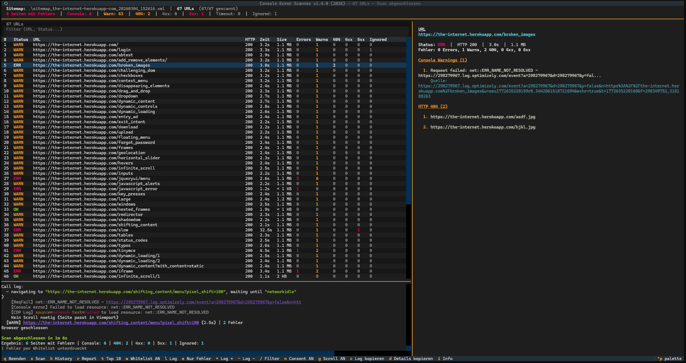
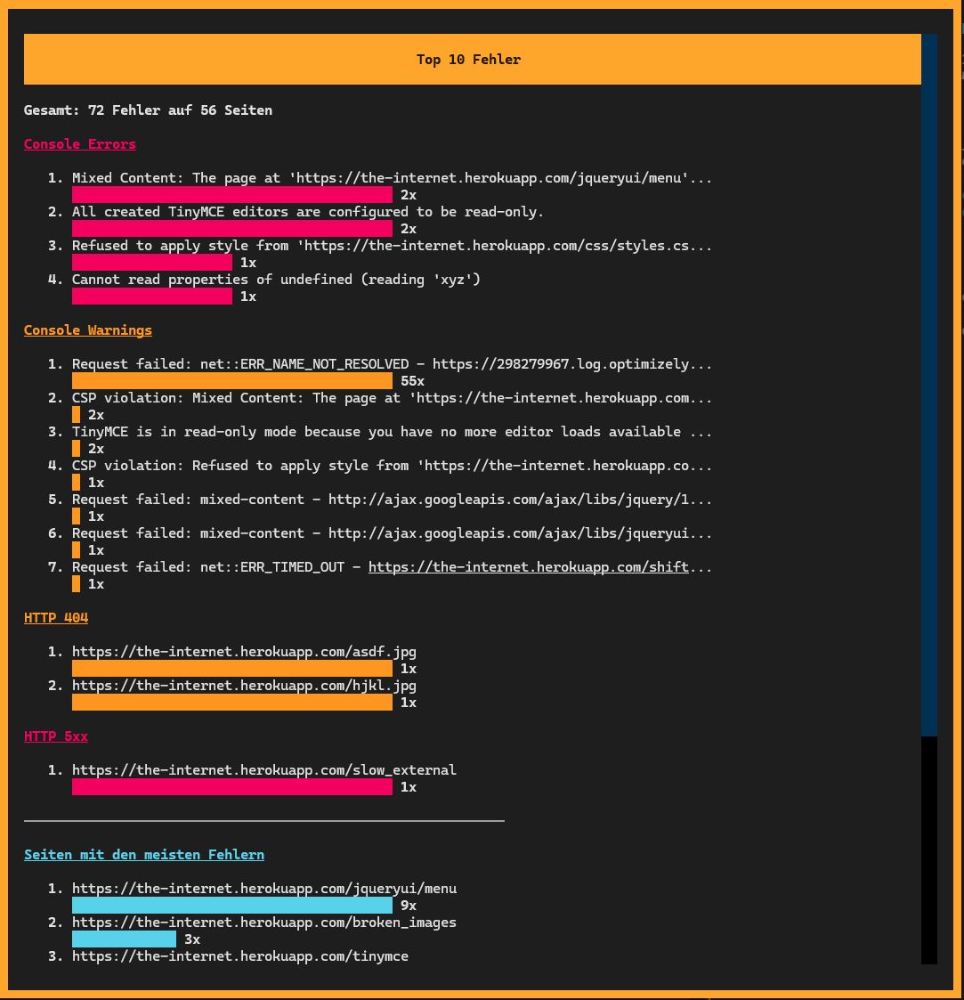
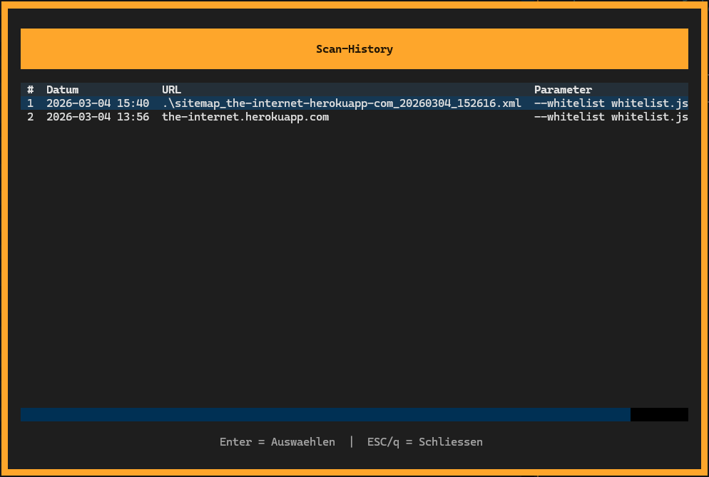

# Console Error Scanner

<p align="center">
   <a href="README.md">English</a> ·
   <b>Deutsch</b>
</p>

---

[](https://github.com/michaelblaess/console-error-scanner/stargazers)
[](https://github.com/michaelblaess/console-error-scanner/network/members)
[](https://github.com/michaelblaess/console-error-scanner/issues)
[](https://github.com/michaelblaess/console-error-scanner/pulls)

[](https://github.com/michaelblaess/console-error-scanner/commits/main)
[](LICENSE)
[](https://www.python.org/)

TUI-Tool zum automatischen Scannen von Websites auf JavaScript Console-Errors und HTTP-Fehler (404, 5xx).
Eingabe ist eine Website-URL oder Sitemap-URL (XML). Bei Domain-URLs wird die Sitemap automatisch über robots.txt und typische Pfade gefunden. Ergebnisse werden live in einer Terminal-UI angezeigt und können als HTML- und JSON-Reports exportiert oder als JIRA-Tabelle (Markdown oder Wiki Markup) direkt in die Zwischenablage kopiert werden.

## Screenshots

### Hauptansicht


### Top 10 Fehler


### Scan-History


## Installation

Keine Abhängigkeiten nötig - kein Python, kein Git, kein Chrome.

```bash
# Linux/macOS
curl -fsSL https://raw.githubusercontent.com/michaelblaess/console-error-scanner/main/install.sh | bash

# Windows PowerShell
irm https://raw.githubusercontent.com/michaelblaess/console-error-scanner/main/install.ps1 | iex
```

Danach ein neues Terminal öffnen und loslegen:

```bash
console-error-scanner https://www.example.com
```

### Aktualisieren

Einfach den Installer erneut ausführen - erkennt vorhandene Installation und überschreibt.

### Deinstallieren

```bash
# Linux/macOS
rm -rf ~/.console-error-scanner ~/.local/bin/console-error-scanner

# Windows PowerShell
Remove-Item -Recurse "$env:LOCALAPPDATA\console-error-scanner"
```

### Installationspfade

| OS | Programm | Wrapper / PATH |
|----|----------|----------------|
| Linux | `~/.console-error-scanner/` | `~/.local/bin/console-error-scanner` |
| macOS | `~/.console-error-scanner/` | `~/.local/bin/console-error-scanner` |
| Windows | `%LOCALAPPDATA%\console-error-scanner\` | `...\bin\console-error-scanner.cmd` (automatisch im PATH) |

## Verwendung

```bash
# Nur Domain angeben - Sitemap wird automatisch gesucht
console-error-scanner https://www.example.com

# Oder direkte Sitemap-URL
console-error-scanner https://www.example.com/sitemap.xml

# Mit mehr parallelen Tabs (Standard: 8)
console-error-scanner https://www.example.com --concurrency 12

# Englische Oberflaeche
console-error-scanner https://www.example.com --lang en

# Nur bestimmte URLs scannen
console-error-scanner https://www.example.com --filter /produkte

# Nur console.error erfassen (ohne Warnings)
console-error-scanner https://www.example.com --console-level error

# Authentifizierung per Cookie (z.B. fuer Testumgebungen)
console-error-scanner https://test.example.com --cookie auth=token123

# Mehrere Cookies setzen
console-error-scanner https://test.example.com --cookie auth=token123 --cookie session=abc

# Bekannte Fehler per Whitelist ignorieren
console-error-scanner https://www.example.com --whitelist whitelist.json

# Cookie-Consent NICHT akzeptieren (Banner wird nur per CSS versteckt)
console-error-scanner https://www.example.com --no-consent

# Lazy-Loading-Scroll deaktivieren (Seite wird nicht durchgescrollt)
console-error-scanner https://www.example.com --no-scroll

# Reports automatisch speichern
console-error-scanner https://www.example.com --output-json report.json --output-html report.html

# Browser sichtbar starten (Debugging)
console-error-scanner https://www.example.com --no-headless
```

## CLI-Parameter

CLI-Flags überschreiben die persistierten Einstellungen für den aktuellen Lauf. Alles außer der URL hat einen sinnvollen Default in `~/.console-error-scanner/settings.json` und ist auch zur Laufzeit über den Einstellungs-Dialog (`s`) erreichbar.

| Parameter | Kurz | Default | Beschreibung |
|-----------|------|---------|-------------|
| `URL_OR_FILE` | | (optional) | Website-URL, Sitemap-URL oder lokale sitemap.xml. Bei Domain-URLs wird die Sitemap automatisch gesucht. Ohne Argument fragt die TUI die URL beim ersten `c` ab |
| `--concurrency` | `-c` | Settings (8) | Max parallele Browser-Tabs |
| `--timeout` | `-t` | Settings (60) | Timeout pro Seite in Sekunden |
| `--output-json` | | | JSON-Report automatisch speichern und beenden |
| `--output-html` | | | HTML-Report automatisch speichern und beenden |
| `--lang` | | Settings (de) | Sprache der Oberfläche (de, en) |
| `--no-headless` | | false | Browser sichtbar starten (Debugging) |
| `--filter` | `-f` | | Nur URLs scannen die TEXT enthalten |
| `--console-level` | | Settings (warn) | error, warn, all |
| `--user-agent` | | Chrome 131 | Custom User-Agent String |
| `--cookie` | | | Cookie setzen (NAME=VALUE), mehrfach verwendbar |
| `--whitelist` | `-w` | Settings | Pfad zur Whitelist-JSON (bekannte Fehler ignorieren) |
| `--no-consent` | | false | Cookie-Consent NICHT akzeptieren (Banner wird nur versteckt) |
| `--no-scroll` | | false | Seite nicht scrollen (kein Lazy-Loading-Trigger) |

### Console-Level

- **error** - Nur `console.error()` erfassen
- **warn** - `console.error()` + `console.warn()` (Standard)
- **all** - Alle Console-Ausgaben (`error`, `warn`, `info`, `log`, `debug`)

> Info/Log/Debug werden **NICHT** erfasst, solange das Level auf `warn` steht.

## Features

- **Sitemap Auto-Discovery**: Bei Domain-URLs wird die Sitemap automatisch über robots.txt und typische Pfade (/sitemap.xml, /sitemap/sitemap.xml, ...) gefunden. Falls keine Sitemap vorhanden ist, kann mit dem [Sitemap Generator](https://michaelblaess.github.io/sitemap-generator) eine erstellt und als URL übergeben werden
- **Sitemap-Datei-Picker**: `m` öffnet einen Datei-Dialog ([textual-fspicker](https://github.com/davep/textual-fspicker)) für lokale sitemap.xml-Dateien — Alternative zur URL-Eingabe
- **Seiten-Vorschau**: Optionaler Playwright-Sidecar rendert in der Detail-Ansicht einen Screenshot der markierten URL (TGP/Sixel-Terminals) mit persistentem Disk-Cache (HTTP-Validator + TTL). Rechtsklick auf das Bild kopiert es in die Zwischenablage (Drag-and-Drop in JIRA / Slack)
- **Site-Score**: Nach jedem Scan wird ein 0-100-Score (Note A-F) aus dem Anteil fehlerfreier Seiten und dem durchschnittlichen Seitengewicht berechnet - die Gewichtung ist einstellbar. Er erscheint farbcodiert im Header-Titel und in einem automatisch öffnenden Zusammenfassungs-Modal mit den Findings und den größten Seiten und den größten Einzelressourcen ("Speicherfresser") als Balken-Charts
- **Diät-Ratgeber**: Rechtsklick auf eine Zeile -> "Diät-Ratgeber" öffnet pro Seite ein Balken-Chart der größten Ressourcen (der "dicken Brocken"), damit sofort sichtbar ist, was die Seite fett macht
- **Rechtsklick-Kontextmenü** auf Ergebniszeilen: URL im Browser öffnen, URL kopieren, Details anzeigen, Diät-Ratgeber, Details kopieren, die sichtbaren Zeilen als JIRA / JSON / Text in die Zwischenablage exportieren, URL erneut scannen, Nur-Fehler-Filter
- **Seitengewicht-Spalte**: Die Spalte "Größe" zeigt das echte Transfergewicht (Summe der Same-Host-Ressourcen über die tatsächliche Antwortgröße, gestreamte Videos/Audios ausgeschlossen, jede Ressource einmal gezählt). Ein einstellbarer Schwellwert hebt zu große Seiten rot mit Warn-Symbol hervor; der Spaltenkopf-Tooltip erklärt die genaue Definition
- **Ladezeit & Requests**: Die Spalte "Zeit" zeigt die Browser-Ladezeit bis zum Load-Event (Navigation Timing API, gleiche Semantik wie DevTools "Load"), die Spalte "Req" die Gesamtzahl aller Requests der Seite (wie der Edge-Netzwerkmonitor). Beide sind sortierbar; das Detail-Panel zeigt zusätzlich DOMContentLoaded. Hinweis: beim parallelen Scan sind die absoluten Ladezeiten contention-behaftet und nur relativ innerhalb eines Scans vergleichbar (siehe Spaltenkopf-Tooltip)
- **Sortierbare Spalten**: Klick auf einen Spaltenkopf sortiert auf-/absteigend mit ▲/▼-Indikator
- **Lazy-Loading Trigger**: Scrollt Seiten automatisch durch, um per IntersectionObserver nachgeladene Bilder zu triggern. Erkennt fehlende Bilder (404) unterhalb des Viewports
- **Consent-Banner Behandlung**: 3-Phasen-Consent (JavaScript-API, Button-Klick Fallback, CSS-Hide) für Usercentrics, OneTrust, CookieBot und generische Banner. Settings-Toggle zwischen Akzeptieren und nur Verstecken
- **CSP-Violation Erkennung**: Erkennt Content Security Policy Verstöße via `pageerror` Events
- **Fehlgeschlagene Requests**: Erkennt abgebrochene/fehlgeschlagene Netzwerk-Requests
- **Cookie-Authentifizierung**: Zugriff auf geschützte Testumgebungen
- **Whitelist**: Bekannte Fehler per Wildcard-Pattern ignorieren (z.B. attachShadow, AppInsights). Mit `w` öffnet sich der Whitelist-Viewer mit Pattern-Liste und Trefferzahlen
- **JIRA-Export**: `j` kopiert eine Tabelle der Fehler-Seiten (URL, HTTP, Status, Fehler-Anzahlen, Details) in die Zwischenablage - direkt in ein Ticket einfügbar. Default ist Markdown für Jira Cloud (wird beim Einfügen automatisch in eine echte Tabelle umgewandelt); Wiki Markup für ältere Server/Data-Center-Instanzen ist unter Einstellungen > Export wählbar
- **Hover-klickbare Links** überall: jede URL und jeder Pfad in Logs, Detail-Ansicht, Dialogen und Toasts öffnet im OS-Standard-Browser/Dateimanager — kein STRG nötig
- **Einstellungs-Dialog** (`s`): zentrale Konfiguration für Concurrency, Timeout, Console-Level, Headless, Consent, Lazy-Loading, Whitelist-Pfad, User-Agent, Cookies, Seiten-Vorschau, den Größen-Warnschwellwert (MB), die Site-Score-Gewichtung und das JIRA-Tabellenformat - mit Info-Icon-Tooltips und Speicherort-Tab
- **Live-Updates**: Ergebnisse erscheinen sofort während des Scans in der Tabelle
- **Auto-Scroll**: Tabelle scrollt automatisch zur aktuell gescannten URL mit
- **36 Retro-Themes**: Ctrl+P öffnet den Theme-Picker, `t` schaltet zum nächsten weiter (persistent)
- **Mehrsprachig**: Deutsch und Englisch (`--lang en`), alle UI-Texte über JSON-Sprachdateien
- **Crash-Guard**: Unbehandelte Exceptions zeigen einen kopierbaren Fehler-Dialog statt die App abstürzen zu lassen
- **Scan-History**: Vorherige Scan-URLs können per `h` wiederhergestellt werden

## Tastenkürzel in der TUI

Die Bindings sind über alle TUIs von Michael einheitlich (`c` = Crawl, `s` = Settings, `t` = Theme, ...).

| Taste | Aktion |
|-------|--------|
| `c` | Scan starten (fragt URL ab, wenn keine geladen ist) |
| `m` | Lokale Sitemap-Datei via Datei-Dialog laden |
| `s` | Einstellungs-Dialog |
| `h` | Scan-History |
| `r` | HTML + JSON Reports speichern |
| `j` | JIRA-Tabelle der Fehler-Seiten in die Zwischenablage kopieren (Markdown für Jira Cloud oder Wiki Markup - konfigurierbar unter Einstellungen > Export) |
| `w` | Geladene Whitelist-Patterns + Trefferzahlen anzeigen |
| `e` | Nur Seiten mit Fehlern anzeigen (Toggle) |
| `t` | Zum nächsten Retro-Theme wechseln (Ctrl+P für vollen Picker) |
| `l` | Log-Panel ein-/ausblenden (Splitter zum Resizen ziehen) |
| `d` | Detail-Ansicht in Zwischenablage kopieren |
| `F10` | Top-10-Fehler-Diagramm |
| `/` | Filter-Eingabe fokussieren |
| `ESC` | Filter leeren / Dialog schließen |
| `?` | HTTP-Statuscode-Referenz |
| `i` | About-Dialog |
| `q` | Beenden |

**Auf dem Vorschau-Bild** (wenn Seiten-Vorschau in den Settings aktiviert ist):
- Rechtsklick = Screenshot in die Zwischenablage kopieren
- Umschalt + Rechtsklick = Screenshot als PNG-Datei speichern

**Auf einer Ergebniszeile**:
- Einfacher Links-Klick markiert die Zeile; **Doppelklick (oder Enter) öffnet das Detailfenster**
- Rechtsklick = Kontextmenü mit `URL im Browser öffnen`, `URL kopieren`, `Details anzeigen`, `Diät-Ratgeber`, `Details kopieren`, `Export JIRA`, `Export JSON`, `Export Text (Zwischenablage)`, `URL erneut scannen`, `Nur Fehler anzeigen / Alle anzeigen`

## Whitelist

Mit einer Whitelist-Datei können bekannte, irrelevante Fehler ignoriert werden. Die Datei ist im JSON-Format:

```json
{
  "description": "Known Bugs - diese Fehler werden ignoriert",
  "patterns": [
    "*Failed to execute 'attachShadow' on 'Element'*",
    "*AppInsights nicht gefunden*",
    "*carouselWrapper is not initialized yet*",
    "HTTP 404:*tracking.js*",
    "*https://googleads.g.doubleclick.net*"
  ]
}
```

**Pattern-Syntax** (fnmatch):
- `*` = beliebig viele Zeichen
- `?` = genau ein Zeichen
- Matching ist **case-insensitive**
- Wird gegen die Fehlermeldung (`PageError.message`) gematcht
- Betrifft **alle Fehlertypen**: Console Errors, Warnings, CSP Violations, HTTP-Fehler

**Status-Anzeige**:
- **OK** - Keine Fehler
- **WARN** - Nur Warnings (keine echten Fehler)
- **ERR** - Echte (nicht-whitelisted) Fehler vorhanden
- **IGN** - Seite hat nur whitelisted Fehler (gelb)
- Whitelisted Fehler erscheinen in einer eigenen "Ignored"-Spalte und als gedimmte Sektion in der Detail-Ansicht

Eine Beispiel-Whitelist liegt im Repository unter `whitelist.json`.

Der Whitelist-Pfad wird im Einstellungs-Dialog konfiguriert (`s` → Whitelist-Pfad) und persistiert; alternativ per `--whitelist <pfad>` auf der CLI. Mit `w` in der TUI öffnet sich der **Whitelist-Viewer** — ein Modal, das jedes geladene Pattern mit der Anzahl der Treffer auf den aktuellen Scan anzeigt.

## Browser-Strategie

Der Scanner versucht beim Start den **System-Chrome** zu nutzen (`channel="chrome"`).
Falls Chrome nicht installiert ist, wird das **gebundelte Chromium** als Fallback verwendet.

| Variante | Größe | Voraussetzung |
|----------|---------|---------------|
| System-Chrome (bevorzugt) | 0 MB extra | Chrome installiert |
| Gebundeltes Chromium (Fallback) | +150 MB | Keine |

## Last auf dem Zielsystem - bitte lesen

Jede Seite wird in einem **echten Browser** geprüft: Skripte, Schriften und Bilder werden geladen,
und der Aufruf läuft an den Zwischenspeichern des Servers vorbei. Eine Seite wiegt damit ein
Vielfaches eines einfachen HTTP-Abrufs. Bei einer großen Sitemap kommen so schnell mehrere hundert
schwere Aufrufe pro Minute zusammen - genug, um ein Produktivsystem spürbar zu verlangsamen.

Der Scanner ist deshalb **von Haus aus gedrosselt**: 60 Seiten pro Minute. Ändern kannst Du das
unter *Einstellungen -> Scanner*, dort lässt es sich für eigene Testsysteme auch abschalten.

`--concurrency` ist **kein** Rate-Limit: Die Einstellung begrenzt, wie viele Browser-Tabs
gleichzeitig laufen, nicht wie viele Seiten pro Minute abgerufen werden. Und gezählt werden die
Seitenaufrufe - was der Browser pro Seite nachlädt, zählt nicht extra, die tatsächliche Last liegt
also höher als die Zahl vermuten lässt.

`robots.txt` wird für die Seiten aus der Sitemap standardmäßig beachtet; gesperrte Seiten werden
übersprungen und im Log ausgewiesen.

## Nutzung auf eigene Verantwortung

Dieses Programm ruft Webseiten automatisiert ab und erzeugt dabei Last auf den Zielsystemen. Je
nach Einstellung kann diese Last die eines normalen Besuchers um ein Vielfaches übersteigen und
die Erreichbarkeit des Zielsystems beeinträchtigen.

Mit der Nutzung erklären Sie:

1. Sie setzen das Programm ausschließlich gegen Systeme ein, für die Ihnen eine ausdrückliche
   Berechtigung des Betreibers vorliegt.
2. Sie tragen die alleinige Verantwortung für den Einsatz, die gewählten Einstellungen und alle
   daraus entstehenden Folgen.
3. Vor einem Lauf gegen ein Produktivsystem prüfen Sie, ob die eingestellten Grenzwerte für
   dieses System angemessen sind.

Die Software wird unentgeltlich und ohne jede Gewährleistung bereitgestellt ("as is"), wie in
Abschnitt 7 der Apache-Lizenz 2.0 beschrieben. Eine Haftung des Autors (Michael Blaess) für
Schäden, die aus der Nutzung entstehen, ist ausgeschlossen, soweit dies gesetzlich zulässig ist.
Unberührt bleibt die Haftung für Vorsatz und grobe Fahrlässigkeit, für Schäden aus der Verletzung
des Lebens, des Körpers oder der Gesundheit sowie nach dem Produkthaftungsgesetz.

Beim ersten Start fragt das Programm diesen Hinweis ab. Die Sprache richtet sich nach Deiner
Systemumgebung - Deutsch nur bei nachweislich deutschsprachiger Umgebung, jeder andere Fall (auch
ein Fehler beim Auslesen) führt zu Englisch.

## Robustheit

- Retry-Logik: 3 Versuche pro Seite mit exponential Backoff (5s, 10s, 20s)
- Browser-Recovery: Automatischer Neustart bei Crash
- Netzwerk-Check: HEAD-Request vor jedem Retry
- Graceful Degradation: Fehlgeschlagene URLs werden markiert, Scan läuft weiter
- Fehler-Deduplizierung: Doppelte Fehlermeldungen werden automatisch zusammengeführt

---

## Entwickler

### Setup

```bash
# Windows
./bootstrap.ps1
./run.ps1 https://www.example.com

# Linux/macOS
./bootstrap.sh
./run.sh https://www.example.com
```

Das Bootstrap-Skript verwendet `uv`, um eine virtuelle Umgebung (`.venv`) zu erstellen, Runtime- und Dev-Dependencies aus `uv.lock` zu installieren, Nuitka fürs Bauen einzurichten und den Chromium-Browser herunterzuladen. Voraussetzungen: Python 3.12+ und [uv](https://docs.astral.sh/uv/).

#### Manuelle Installation

```bash
# 1. Virtuelle Umgebung erstellen
uv sync --extra dev

# 2. Playwright Chromium-Browser installieren
uv run playwright install chromium
```

Bei SSL-Problemen im Firmennetz (Zscaler etc.) siehe `bootstrap.ps1`: `UV_NATIVE_TLS=1` setzen, `SSL_CERT_FILE` leeren, dann fällt uv auf den Windows-Zertifikatsspeicher zurück.

### Lokaler Build (Standalone-Binary)

Der Build basiert auf **Nuitka** (kompiliert Python zu einer nativen Binary, kein Interpreter auf dem Zielrechner):

```bash
# Windows
./compile-win64.ps1

# Linux  (benötigt gcc + patchelf + python3-dev)
./compile-linux.sh

# macOS  (benötigt Xcode Command Line Tools)
./compile-macos.sh
```

Erstellt `dist/console-error-scanner/` (~180 MB inkl. Chromium Headless-Shell) und ein versionsbenanntes `.zip` / `.tar.gz` daneben.

### Release erstellen

1. Version-Tag setzen und pushen:
   ```bash
   git tag v1.0.0
   git push origin v1.0.0
   ```

2. GitHub Actions baut automatisch für alle Plattformen:
   - `console-error-scanner-win-x64.zip`
   - `console-error-scanner-linux-x64.tar.gz`
   - `console-error-scanner-macos-arm64.tar.gz`

3. Release wird automatisch auf GitHub erstellt mit den Build-Artefakten.

### Architektur

```
src/console_error_scanner/
  __main__.py           CLI Entry Point (argparse, pre-init textual-image)
  app.py                Textual App (CrashGuard, LogRouter, ClickableLinks)
  app.tcss              Textual CSS (Layout)
  i18n.py               Internationalisierung (t()-Funktion)
  locale/
    de.json             Deutsche Sprachdatei
    en.json             Englische Sprachdatei
  models/
    scan_result.py      ScanResult, PageError, Enums (response_headers, content_type, last_modified)
    sitemap.py          Sitemap-Parser + Auto-Discovery
    history.py          Scan-History Persistenz
    settings.py         Settings (theme, language, concurrency, timeout, console_level,
                        consent, lazy_load, whitelist, headless, preview, ...)
    whitelist.py        Whitelist (Wildcard-Pattern Matching)
  widgets/
    results_table.py    ResultsDataTable (Rechtsklick-Kontextmenü, sortierbare Spalten) +
                        SearchInputWithHistory-Filter + Auto-Scroll
    stats_panel.py      Detail-Pane: Page / HTTP-Header (collapsible) / Errors /
                        Warnings / Whitelist / Info Rich-Panels
    preview_panel.py    Screenshot-Vorschau via textual-image (TGP/Sixel) oder Halfblock
    summary_panel.py    InfoHeader oben (4 Spalten: Ziel / Konfig / Fehler / Fortschritt)
  screens/
    error_detail.py     Modal: Fehlerdetails (Markup + Hover-Links + Close-Button)
    top_errors.py       Modal: Top-10-Fehler-Chart (auto-height + Close-Button)
    history.py          Modal: Scan-History (Auswählen + Schließen-Buttons)
    whitelist.py        Modal: Whitelist-Viewer (Patterns + Trefferzahlen)
    settings.py         BaseSettingsScreen: Scanner-Tab + Sprach-Tab + Speicherort-Tab
  services/
    scanner.py          Playwright Scanner (Retry, Recovery, Response-Headers)
    reporter.py         HTML + JSON Report + JIRA-Tabellen-Generator
    preview_service.py  Playwright-Sidecar + Disk-Cache für Vorschau-Screenshots
    image_clipboard.py  Cross-Plattform Image-to-Clipboard (Win: pywin32, macOS: osascript,
                        Linux: xclip/wl-copy)
```

Basiert auf [textual-themes](https://github.com/michaelblaess/textual-themes) (36 Retro-Paletten),
[textual-widgets](https://github.com/michaelblaess/textual-widgets) (CrashGuard, LogPanel,
BaseSettingsScreen, AboutScreen, UrlInputScreen, ContextMenuScreen, Splitter, InfoHeader,
ClickableLinksMixin) und [textual-fspicker](https://github.com/davep/textual-fspicker)
(FileOpen-Dialog).
